# 01. 程序结构

LabVIEW 同其它所有编程语言一样，同样具有顺序、判断、循环结构

## 01.1 平铺式顺序结构

- LabVIEW 天然并行性：程序框图中的控件顺着数据流同时执行，因此如果想让不同的部分先后执行，需要使用专门的顺序结构

包括一个或多个顺序执行的子程序框图，一个框图成为一帧，平铺式顺序结构确保其中的每一帧顺序执行。如下图：

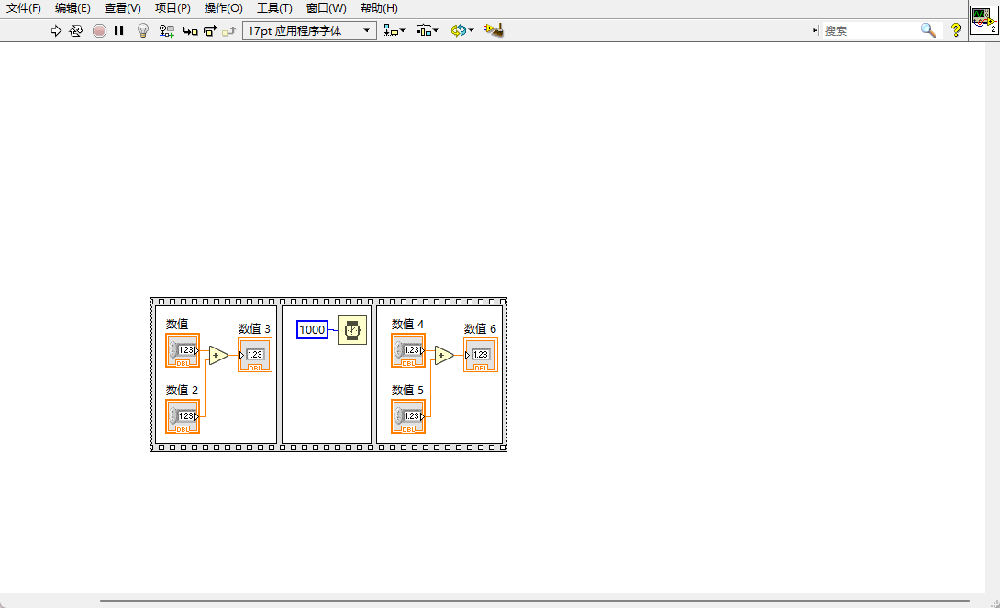

- 与平铺式顺序结构相对的还有层叠式顺序结构，它仅仅是将帧堆叠了起来。选中平铺式顺序结构后可以转换为层叠式顺序结构

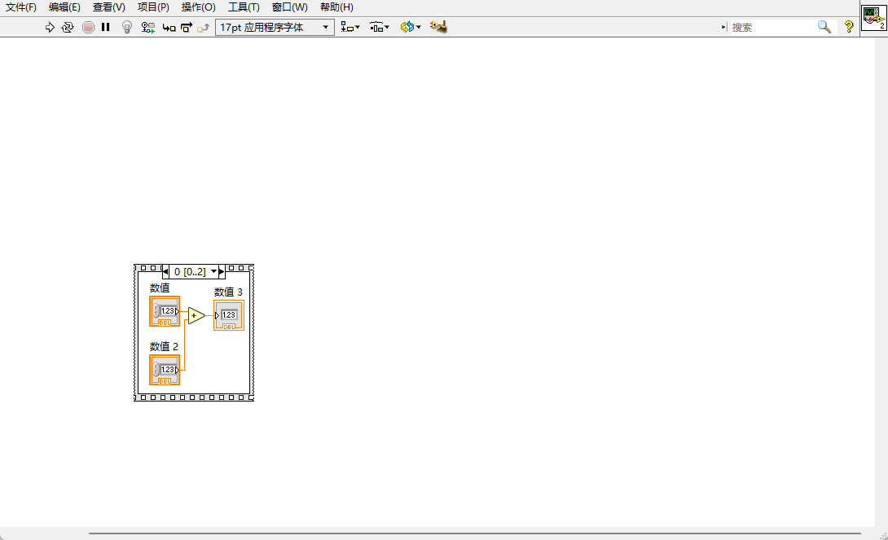

对层叠式顺序结构也可以转换为平铺式顺序结构

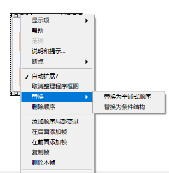

### 扩展：如何在多个位置对一个控件赋值

- 设置属性节点，以数值显示控件为例：

- 然后对属性节点设置为写入：

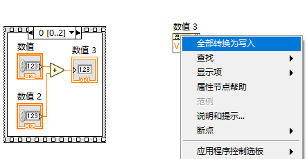

## 01.2 For 循环

- For 循环控制程序循环 N 次，如下图，控制小灯亮灭各 50 次

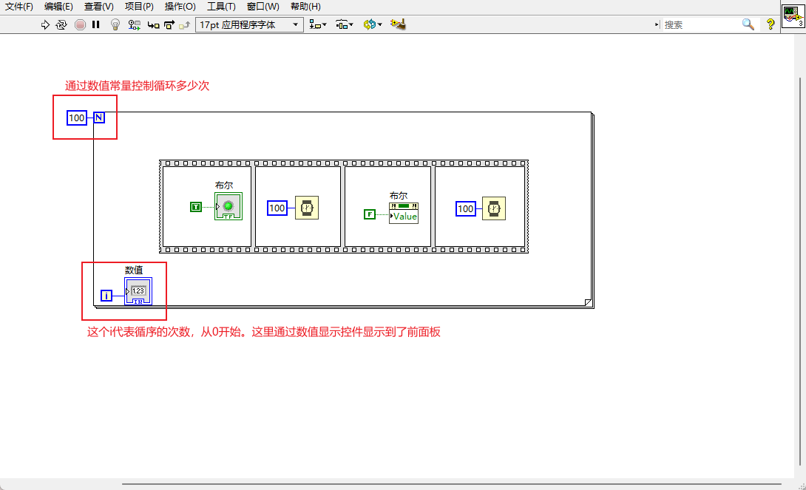

- 前面板

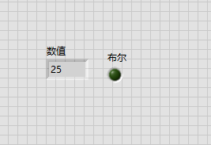

### 中途停止 For 循环

- 打开条件接线端

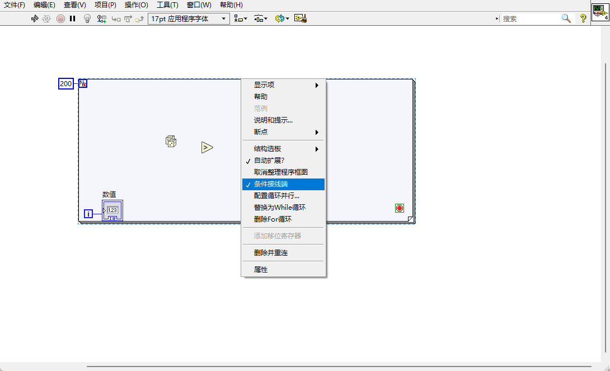

- 设置终止条件：

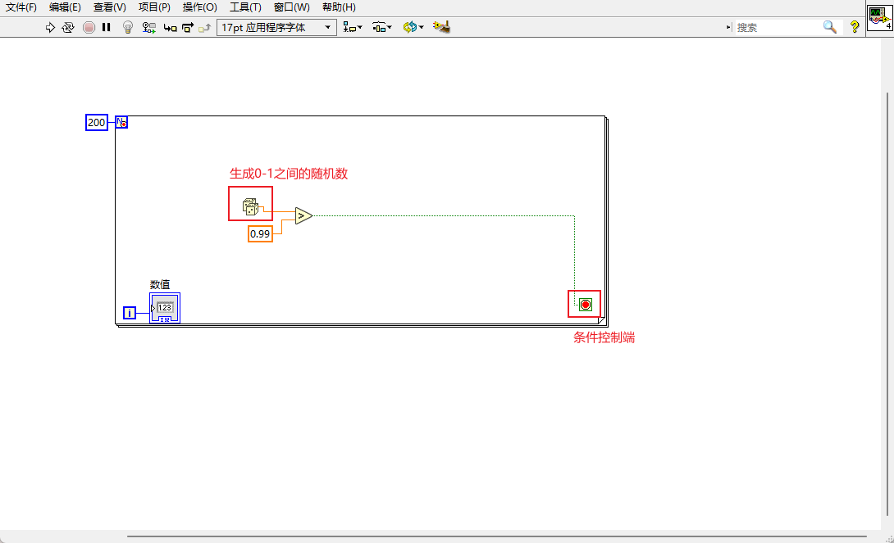

> 条件控制端在为 False 时让循环执行，为 True 时停止循环

## 01.3 while 循环

while 循环用于执行不确定次数的循环，它的条件控制端逻辑同 For 循环，中途停止的方法也与 For 循环相同。下图使用 while 循环配合波形显示图表来显示波形

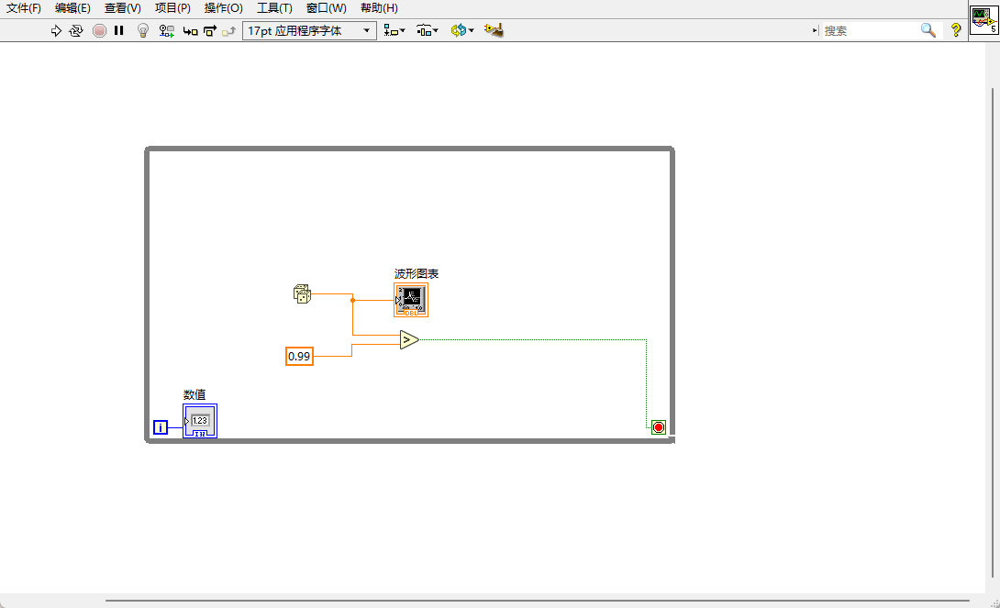

前面板如下：

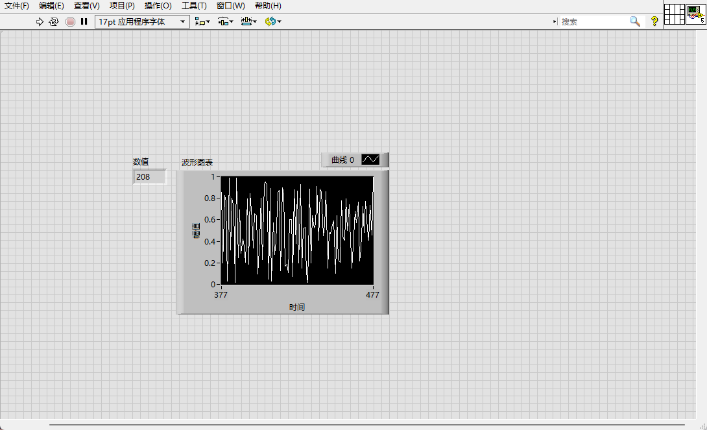

## 01.4 条件结构

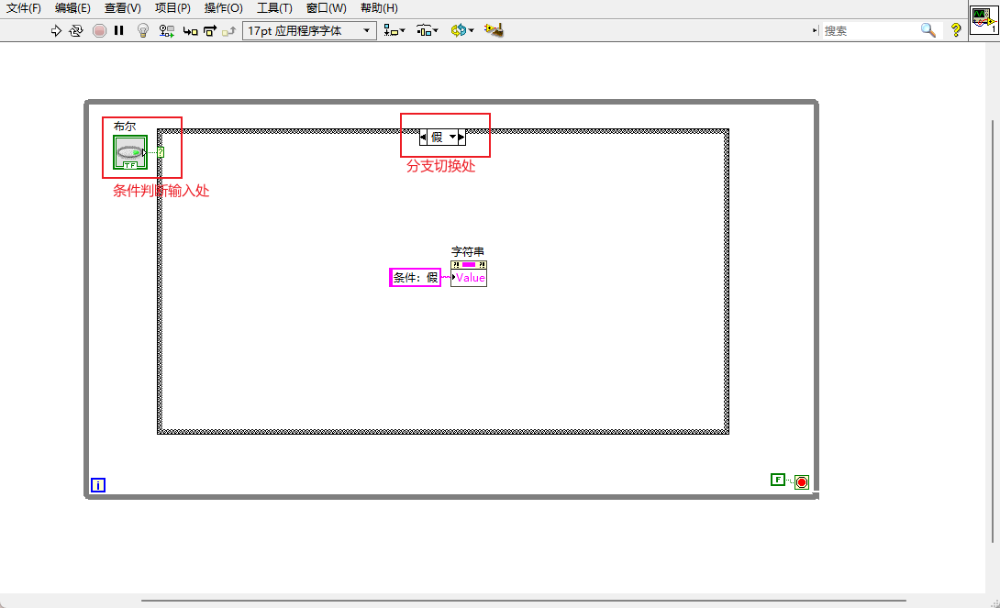

- 条件结构的条件判断除了布尔类型外，还可以时整形和字符串类型。如果条件判断处是整形，则会以默认分支和其它分支两种程序分支
- 使用整形进行条件判断

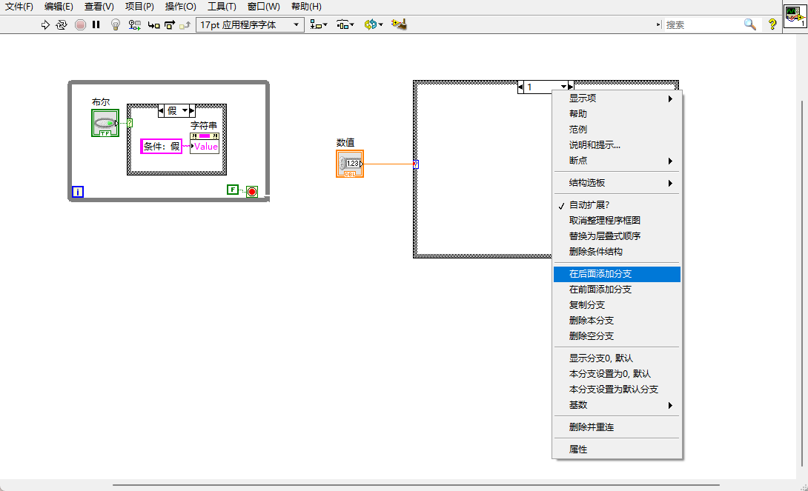

- 可以看到通过右键进行添加分支、删除分支、设置默认分支的操作

## 01.5 事件结构

发生一个事件时，执行事件结构内的程序，如下图，给通过按钮事件控制灯的亮灭

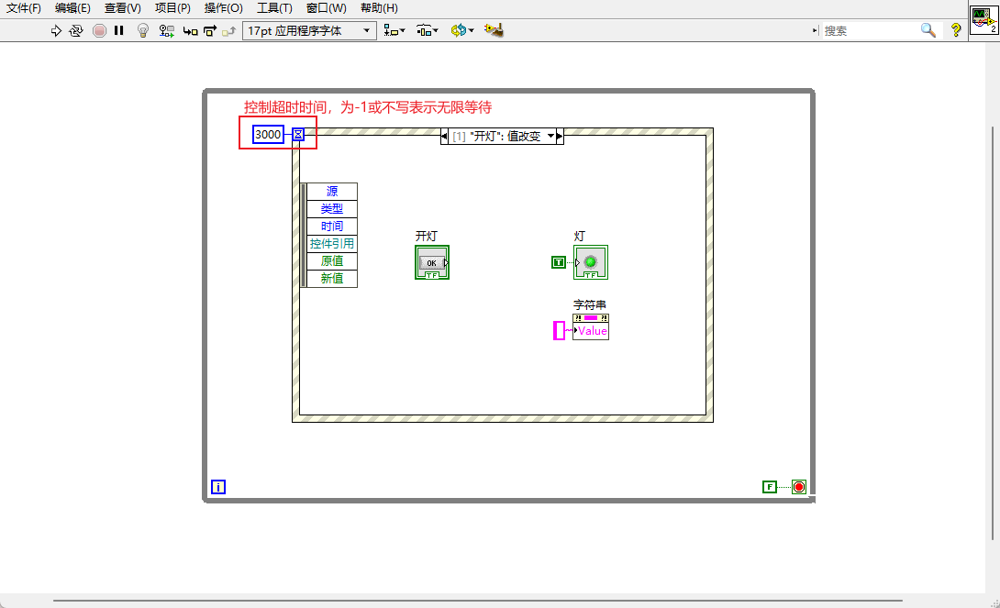

- 如何添加新事件
- 先右键，选择添加事件分支

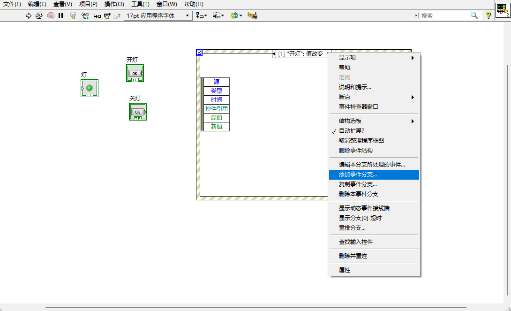

- 之后进入事件分支选择界面，该界面列出所有可用的事件，这里的控件来自于前面板添加

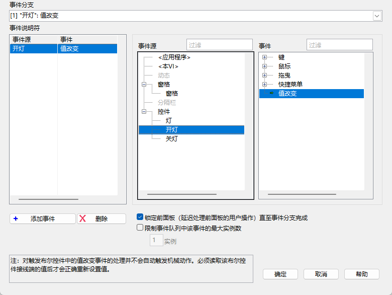

- 程序前面板

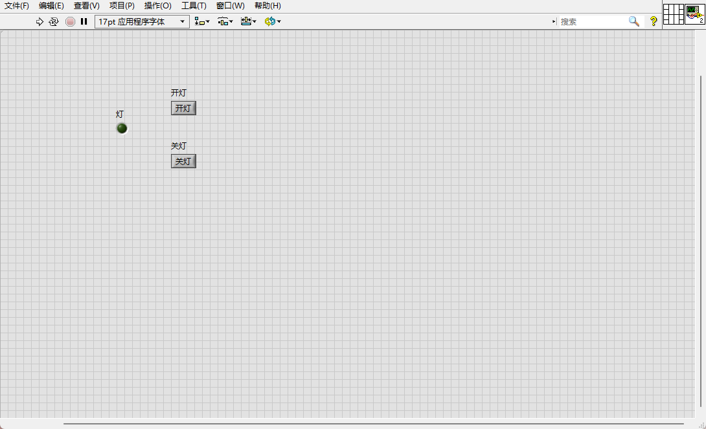