# 01. 程序结构

LabVIEW 同其它所有编程语言一样，同样具有顺序、判断、循环结构

## 01.1 平铺式顺序结构

- LabVIEW 天然并行性：程序框图中的控件顺着数据流同时执行，因此如果想让不同的部分先后执行，需要使用专门的顺序结构

包括一个或多个顺序执行的子程序框图，一个框图成为一帧，平铺式顺序结构确保其中的每一帧顺序执行。如下图：

- 与平铺式顺序结构相对的还有层叠式顺序结构，它仅仅是将帧堆叠了起来。选中平铺式顺序结构后可以转换为层叠式顺序结构

对层叠式顺序结构也可以转换为平铺式顺序结构

### 扩展：如何在多个位置对一个控件赋值

- 设置属性节点，以数值显示控件为例：

- 然后对属性节点设置为写入：

## 01.2 For 循环

- For 循环控制程序循环 N 次，如下图，控制小灯亮灭各 50 次

- 前面板

### 中途停止 For 循环

- 打开条件接线端

- 设置终止条件：

> 条件控制端在为 False 时让循环执行，为 True 时停止循环

## 01.3 while 循环

while 循环用于执行不确定次数的循环，它的条件控制端逻辑同 For 循环，中途停止的方法也与 For 循环相同。下图使用 while 循环配合波形显示图表来显示波形

前面板如下：

## 01.4 条件结构

- 条件结构的条件判断除了布尔类型外，还可以时整形和字符串类型。如果条件判断处是整形，则会以默认分支和其它分支两种程序分支
- 使用整形进行条件判断

- 可以看到通过右键进行添加分支、删除分支、设置默认分支的操作

## 01.5 事件结构

发生一个事件时，执行事件结构内的程序，如下图，给通过按钮事件控制灯的亮灭

- 如何添加新事件
- 先右键，选择添加事件分支

- 之后进入事件分支选择界面，该界面列出所有可用的事件，这里的控件来自于前面板添加

- 程序前面板

事件结构的一个分支可以捕获多个事件，以下是操作过程：

- 在前面板放置两个确定按钮和一个字符串显示控件

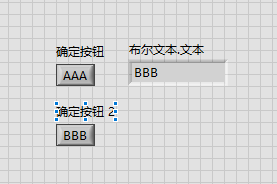

- 先按正常添加事件的流程添加“确定按钮”的事件到事件结构中，再添加“确定按钮2”到事件结构中的“确定按钮”的分支中。这个操作需要右键选择“编辑本分支处理的事件”，之后弹出如下对话框

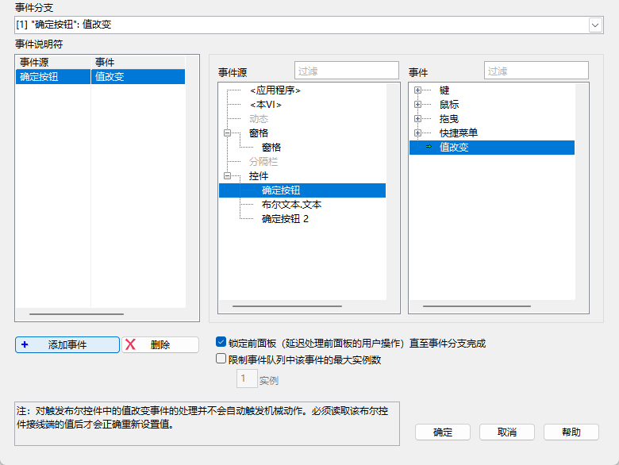

- 在该对话框中选择“确定按钮2”，添加后，事件结构的分支显示栏会变得如下

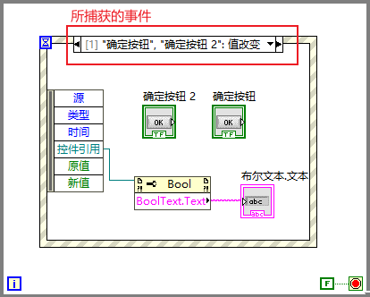

- 同时可以通过“控件引用”来获得是哪个控件触发的事件，这里通过添加属性节点和字符串显示控件的方式来显示是哪个按钮触发的事件，添加的方法如下

    - 右键，在应用程序控制中添加属性节点

    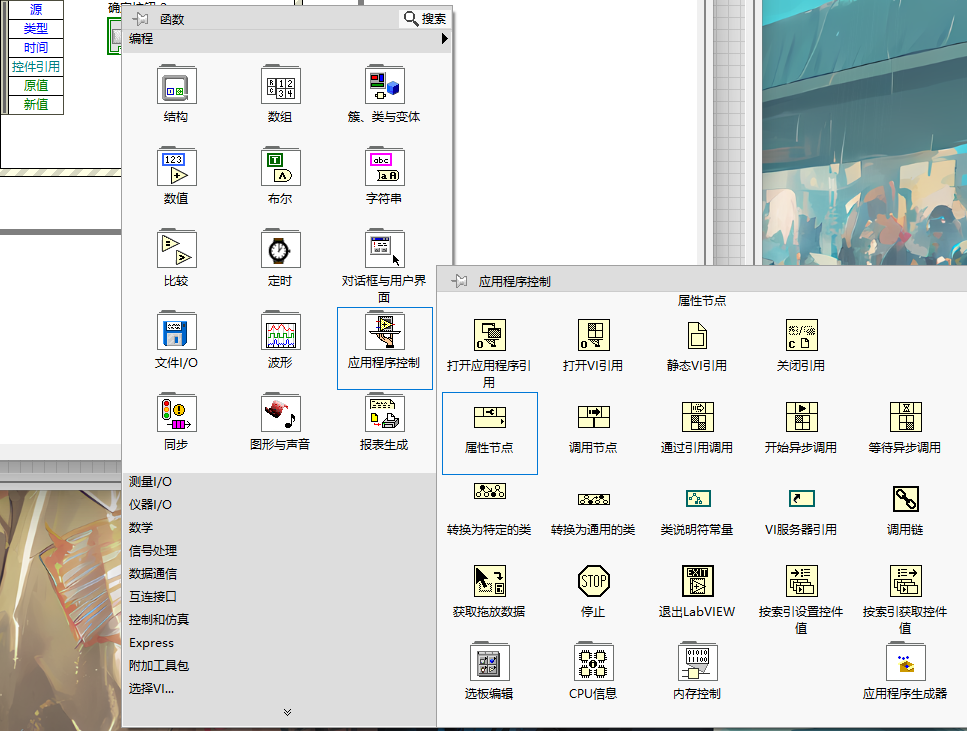

    - **先将“控件引用”连接到属性节点**再右键属性节点按下图进行选择

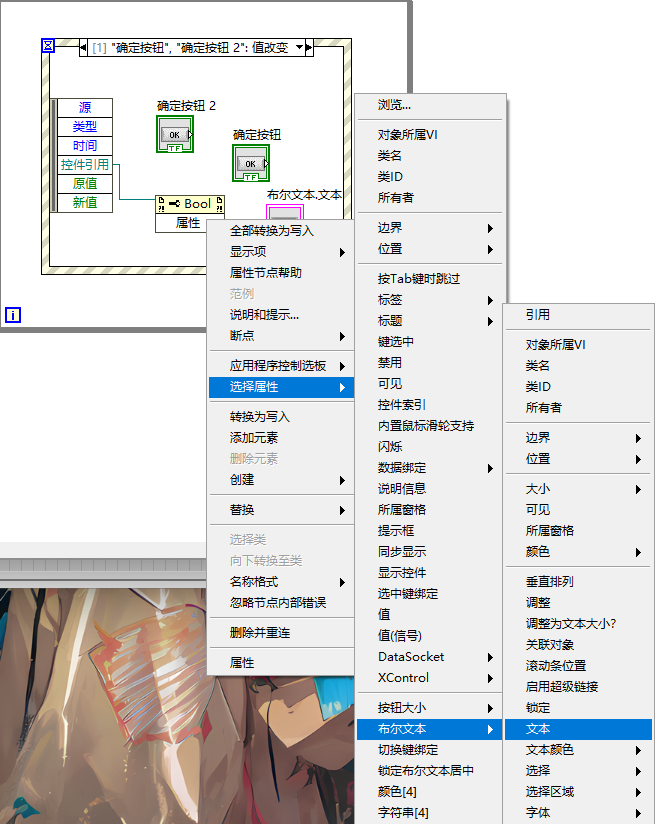

## 01.6 禁用结构

相当于文本编程语言中的注释。除禁用结构外，还可以在空白的地方双击，即可输入文本注释

## 01.7 循环中的隧道模式与移位寄存器

- 隧道模式

将数值控件如随机数控件连接到循环的框上，即可在框上产生隧道，如：

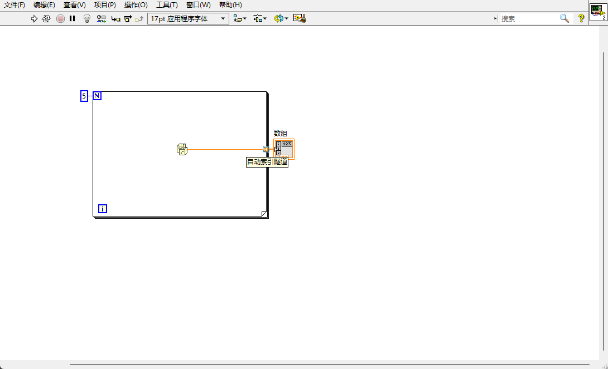

这是自动索引隧道，该隧道可将每次循环时数值控件的值保存到一个数组内。除了自动索引隧道，还有最终值隧道，对隧道模式的切换如下图：

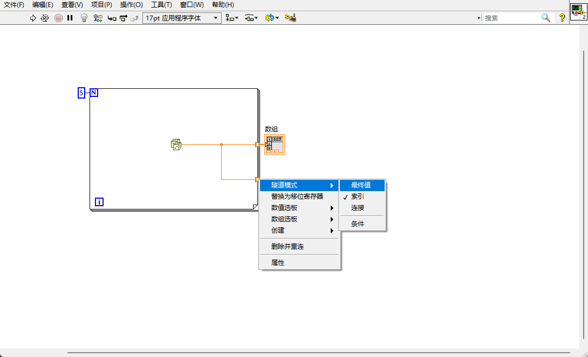

最终值隧道可以将数值控件在最后一次循环的值保存下来

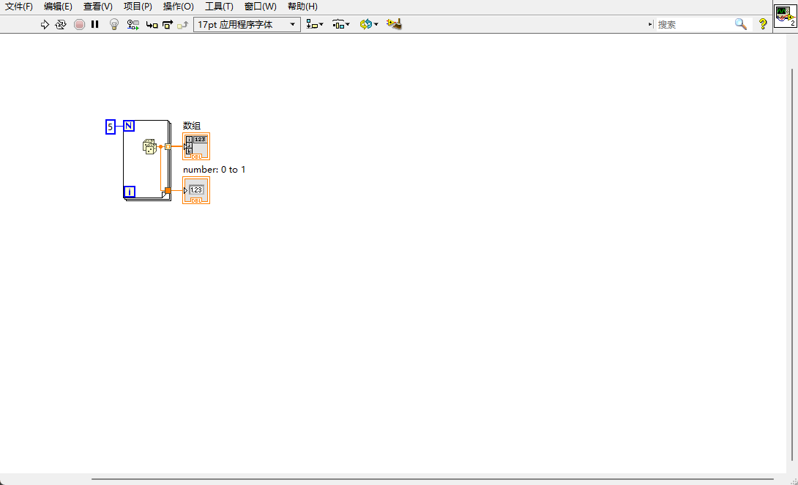

- 移位寄存器

移位寄存器可用于将上一次循环的值传递至下一次循环。以下红框部分利用移位寄存器计算 0-100 的和

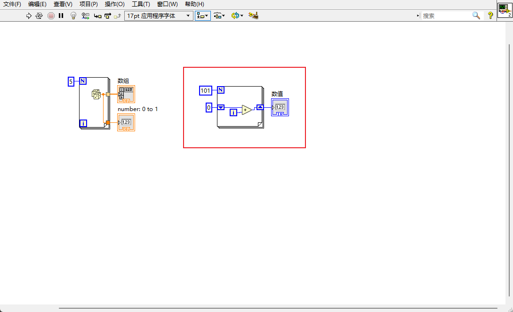

一个循环可以添加多个移位寄存器，如下图所示：

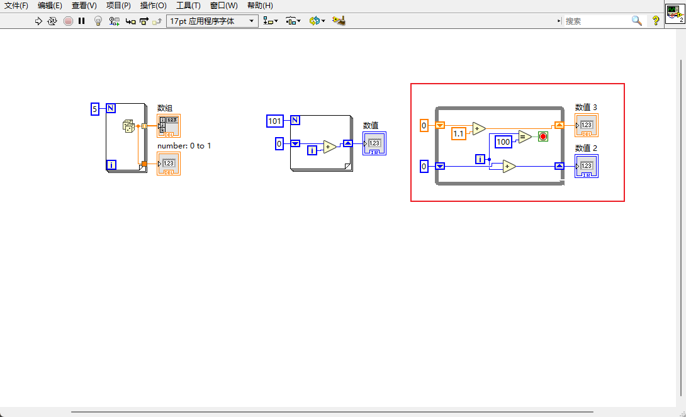

- 移位寄存器可以堆叠，称为层叠移位寄存器。层叠移位寄存器可以访问循环前 N 次的值，添加的方法如下：

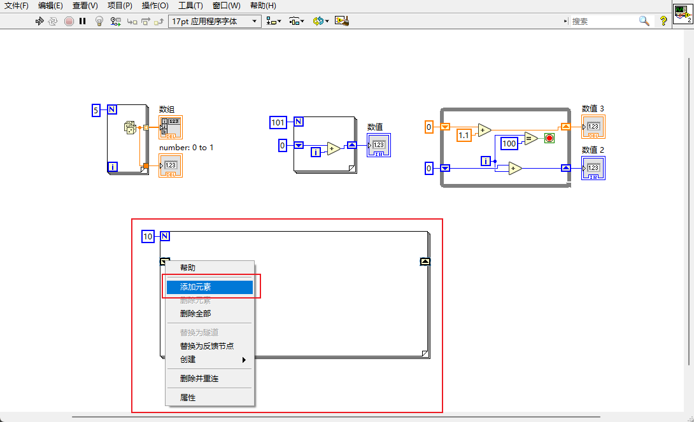

# 02. 程序结构-练习

## 02.1 一个按钮停止多个循环

- 主要使用 STOP 控件，该控件接收真常量，然后停止程序运行，效果同主动按下控制面板的停止按钮

- STOP 控件位于函数->应用程序控制内

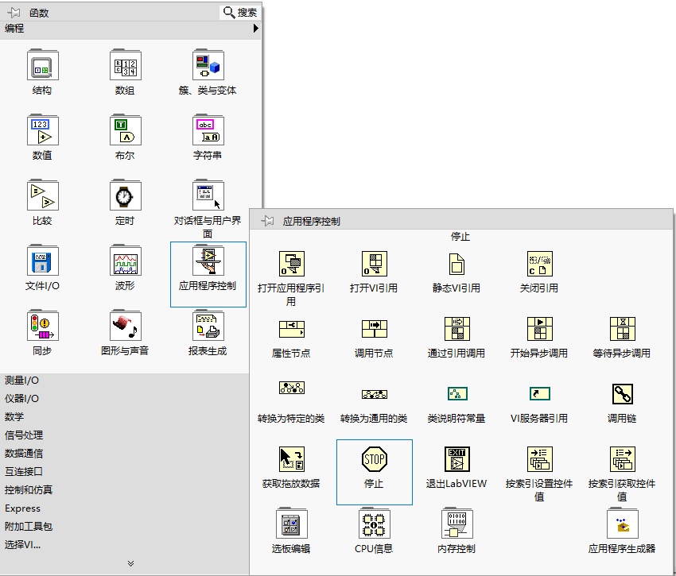

- 程序面板如下

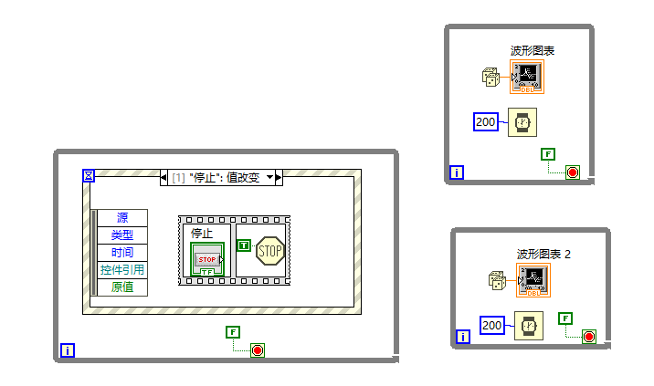

> 使用平铺式结构的原因是让按钮能从按下的状态返回。如果不加此结构，由于 LabVIEW 并行执行的特点，事件结构中的按钮和 STOP 同时运行，STOP 后程序结束，按钮来不及返回未按下的状态

- 前面板

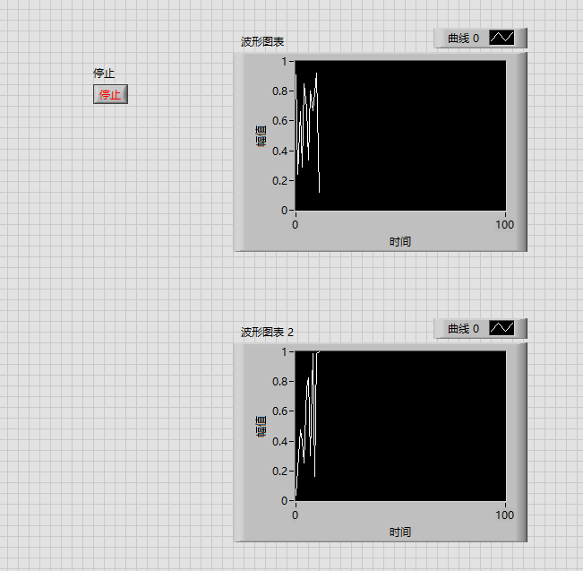

## 02.2 获取按钮上的文本

- 通过下图方式创建属性节点

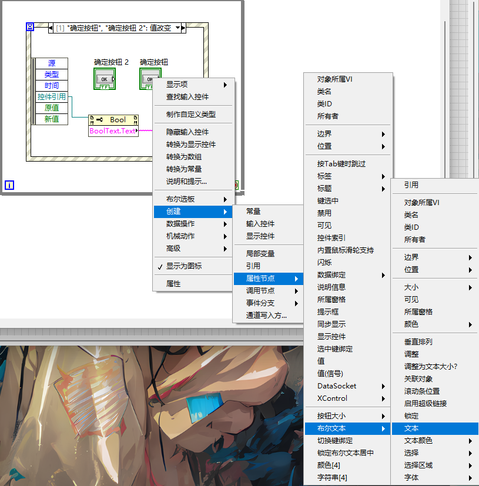

- 之后可通过文本显示控件在前面板显示按钮上的文本

# 03. 数据类型

## 03.1 数值与布尔

## 03.2 数组与簇

数组的内容为相同的数据类型，簇的内容为不同的数据类型。簇的输入输出类型由放进去的第一个数据决定。且簇只能都是输入或输出类型。

# 04. 变量调用

## 一个有问题的程序

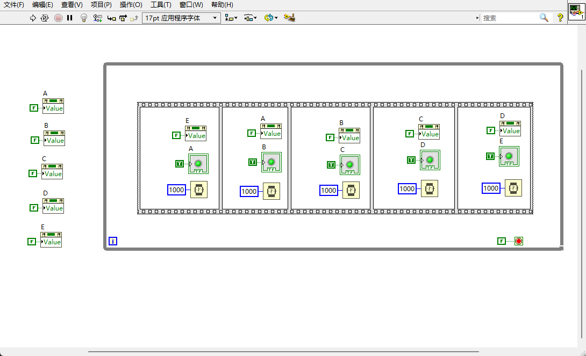

该程序让五个灯顺序点亮，但每次开始执行时，第一个灯都没亮起来。

- 原因

LabVIEW 并行执行且按数据流运行。启动时，接近同时给灯 A 赋值真与假，但由于给控件赋值速度要快于给属性节点赋值，因此，灯 A 实际上是以极短的时间亮然后灭。为解决该问题可以将灯 A 的初始化时赋值假的代码通过错误输出连接到 while 循环中，如下图所示：

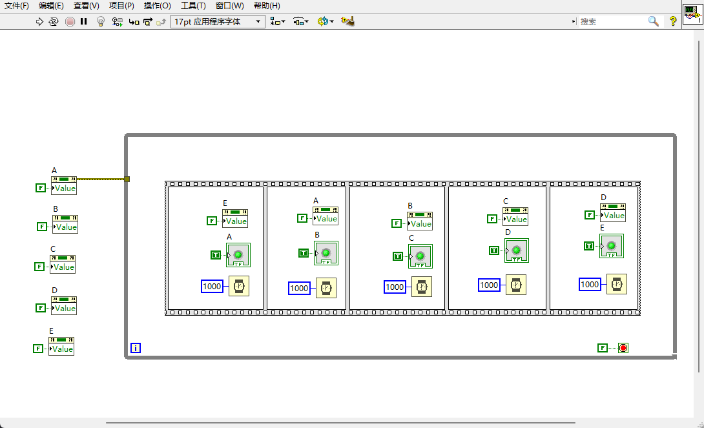

这样相连后，类似于使用了顺序结构，确保初始化部分会先于 while 循环来执行。同样，可以将其它灯的初始化也通过错误输出连接到 while 循环上。

- 局部变量与属性节点相比，局部变量没有错误输出，对数据流的体现没有属性节点好
