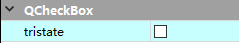

# 01.

QMainWindow 与 QDialog 继承自 QWeight，QWeight 仅提供一个空窗口，QMainWindow 与 QDialog 则再提供了一些控件

## 01.1 First Project

### 01.1.1 main 函数

- `QApplication a(argc, argv);` : 应用程序对象，有且只有一个
- `Widget w;` : 窗口对象，widget 的父类
- `w.show();` : 必须调用 show() 方法才会显示窗口
- `a.exec();` : 进入消息循环，阻塞在此

### 01.1.2 快捷键

- 正行移动：ctrl + shift + 上箭头或下箭头
- 帮助文档：F1
- 自动对齐：ctrl + i
- 同名之间的 `.h` 和 `.cpp` 切换：F4

### 01.1.3 按钮常用 API

- 创建: 

  - 头文件: 

  ```cpp
  QPushButton *btn = nullptr;
  QPushButton *btn1 = nullptr;
  ```
  
  - 源文件: 
  
  ```cpp
  btn = new QPushButton(this);
  btn1 = new QPushButton("Second Button", this);
  
  // 析构函数里记得删除
  delete btn;
  delete btn1;
  
  btn = nullptr;
  btn1 = nullptr;
  ```
  
- 显示文本: `btn->setText("First Button");` 

- 移动按钮: `btn1->move(100, 100);` 

- 按钮重设大小: `btn1->resize(150, 50);` 

> 窗口常用 API
>
> - 重置窗口大小: `resize(600, 480);` 
> - 固定窗口大小: `setFixedSize(600, 480);` 
> - 设置窗口标题: `setWindowTitle("My First Window");` 

## 01.2 对象树

在 Qt 中创建对象时会提供一个 Parent 对象指针，下面来解释这个 parent 到底是干什么的

- QObject 是**以对象树的形式组织起来的** 

  - 当创建一个 QObject 对象时，会看到 QObject 的构造函数接收一个 QObject 指针作为参数，这个参数就是 parent，也就是父对象指针

    这相当于，**在创建 QObject 对象时，可以提供一个其父对象，我们创建的这个 QObject 对象会自动添加到其父对象的 children() 列表** 

  - **当父对象析构的时候，这个列表中的所有对象也会被析构。（注意：这里的父对象不是继承意义上的父类）** 

    这种机制在 GUI 程序设计中相当有用。例如，一个按钮有一个 QShortcut（快捷键）对象作为其子对象。当我们删除按钮时，这个快捷键理应被删除，这是合理的

- QWidget 是能够在屏幕上显示的一切组件的父类

  - **QWidget继承自 QObject，因此也继承了这种对象树关系，一个子类自动成为父组件的一个子组件。**因此，它会显示在父组件的坐标系统中，被父组件的边界剪裁。例如，当用户关闭一个对话框的时候，应用程序将其删除，那么，我们希望属于这个对话框的按钮、图标等应被一起删除

- 析构顺序：从底向上，先析构 childre() 列表中的对象

> 为什么会先执行父类的析构函数：在父类析构函数中寻找子类对象并析构，因此能看到有些父类析构函数代码先执行，但应注意在所有子类被析构完成前，父类析构函数才执行完成

- 构造时指定 parent 对象，并且大胆的在堆上创建

## 01.3 Qt 坐标系

- 以左上角为 (0, 0) ，X 向右增加，Y 向下增加
- 对于嵌套窗口，其坐标是**相对于父窗口**来说的

## 01.4 信号和槽

- 信号：控件发送的消息，比如按钮被点击后发送一个信号
- 槽：信号的接收者，处理信号
- 信号和槽的优点：松散耦合，信号发送端和接收端没有直接连接，而是通过信号连接到一起
- 连接函数：connect()
  - 参数 1：信号的发送者
  - 参数 2：发送的信号（函数的地址）
  - 参数 3：信号的接收者
  - 参数 4：处理的槽函数

## 01.5 自定义信号和槽

- 自定义信号
  - 写到 signals 下
  - 返回 void
  - 需要声明，不需要实现
  - 可以有参数，可以重载
- 自定义槽函数
  - 返回 void
  - 需要声明，需要实现
  - 可以有参数，可以重载
  - 写到 public slot 下或者 public 或者全局函数
- 触发自定义信号
  - `emit` 自定义信号

### 01.5.1 当自定义信号和槽出现重载

- 需要利用函数指针明确指向函数的地址

```c++
void (Teacher:: *teacherSignal)(QString) = &Teacher::hungry;
void (Student:: *studentSlot)(QString) = &Student::treat;
connect(zt, teacherSignal, st, studentSlot);
```

- 将 QString 转为 `char *` : `.toUtf8().data()` 

### 01.5.2 信号连接信号

```c++
// 无参信号和槽连接
void (Teacher:: *teacherSignal2)(void) = &Teacher::hungry;
void (Student:: *studentSlot2)(void) = &Student::treat;
connect(zt, teacherSignal2, st, studentSlot2);
// 信号连接信号
connect(btn, &QPushButton::clicked, zt, teacherSignal2);
```

- 断开连接：`disconnect(zt, teacherSignal2, st, studentSlot2);` 

## 01.6 拓展

- 一个信号可以连接多个槽函数
- 多个信号可以连接一个槽函数
- 信号和槽函数的参数，必须类型一一对应
- 信号和槽的参数个数，是否需要一致？
  - 信号的参数个数可以多于槽函数的参数个数
  - 但需要保证剩余参数的类型一致

### 01.6.1 Qt4 版本以前的的信号和槽连接方式

`connect(zt, SIGNAL(hungry()), st, SLOT(treat()));` 

优点：参数直观

缺点：类型不做检测（编译器不会检查这个错误，仅在运行阶段有一个命令行提示）

> Qt4 没有类型检测的原因：
>
> SIGNAL(hungry()) 中函数名被转换为字符串格式：SIGNAL("hungry")，通过字符串匹配查找函数

## 01.7 lambda 表达式

C++11 中用于**定义创建匿名的函数对象**，以简化编程工作

- 基本构成：

```
[capture](parameters)mutable->return_type
{
	statement
}
```

- 函数对象参数：

  `[]` ，表示一个 lambda 的开始，这部分必须存在，**不能省略**，函数对象参数是传递给编译器自动生成的函数对象类的构造函数。函数对象参数只能使用那些到定义 lambda 为止时 lambda 所在作用范围内可见的局部变量（包括 lambda 所在类的 this）。函数对象参数有一下几种形式：

  - 空。没有使用任何函数对象参数
  - =。函数体可以使用 lambda 所在作用范围内的所有可见的局部变量（包括 this），并且是**值传递方式**
  - &。函数体可以使用 lambda 所在作用范围内的所有可见的局部变量（包括 this），并且是**引用传递方式**
  - this。函数体可以使用所在类中的成员变量
  - a。将 a 按值传递，函数体内不能修改传递进来的 a 的拷贝，因为默认情况下函数是 const 的，**要修改传递进来的 a 的拷贝，可以使用 mutable 修饰符**
  - &a。将 a 按引用传递
  - a, &b。将 a 按值传递，b 按引用传递
  - =, &a, &b。除 a 和 b 按引用传递外，其它的按值传递
  - &, a, b。除 a 和 b 按值传递外，其它的按引用传递

- 操作符重载函数参数：

  - 标识重载的 () 操作符的参数，没有参数时，这部分可以省略。参数可以通过按值（如(a, b)）和按引用（如(&a, &b)）两种方式进行传递

- 可修改操作符

  - mutable 声明，这部分可以省略。按值传递函数对象参数时，加上 mutable 修饰符后，可以修改按值传递进来的拷贝（不是值本身）

```c++
[=]()mutable {}
```

- 函数返回值：

  `->` 返回值类型，标识函数返回值的类型，当返回值为 void，或者函数体中只有一处 return 的地方（此时编译器可以自动推断出返回值类型）时，这部分可以省略

```c++
int ret = []()->int{return 1000;}();
```


- 一个示例

```c++
[=](){
	btn->setText("aaa");
}();
```

> 最后的那个括号表示调用，否则仅仅表示定义了一个匿名函数
>
> 一般建议值传递

- 一个示例

```c++
// 利用lambda表达式实现点击按钮关闭窗口
QPushButton *btn2 = new QPushButton(this);
btn2->setText("close");
btn2->move(0, 50);
connect(btn2, &QPushButton::clicked, this, [=](){this->close();});
```

# 02.

## 02.1 QMainWindow

QMainWindow 是一个为用户提供主窗口程序的类，包含一个菜单栏（menu bar）、多个工具栏（tool bar）、多个锚接部件（dock widgets）、一个状态栏（status bar）及一个中心部件（central widget）

## 02.2 菜单栏

- 菜单栏最多只有一个
- 代码示例

```c++
// 解决菜单栏不显示的问题
// 代码模式：自己的类->setNativeMenuBar(false);
// ui模式：
ui->menubar->setNativeMenuBar(false);

// 创建菜单栏，菜单栏最多只能有一个
QMenuBar *bar = menuBar();
// 将菜单栏放入到窗口中
setMenuBar(bar);

// 但由于菜单栏是空的，所以它依然不会显示
// 创建菜单
QMenu *fileMenu = bar->addMenu("File");
QMenu *editMenu = bar->addMenu("Edit");

// 创建菜单项
QAction *newAction = fileMenu->addAction("new");
// 添加分隔线
fileMenu->addSeparator();
QAction *openAction = fileMenu->addAction("open");
```

## 02.3 工具栏

- 工具栏可以有多个
- 代码示例

```c++
// 工具栏，可以有多个
QToolBar *toolBar = new QToolBar(this);
// 将工具栏放到窗口中，默认在上方
// addToolBar(toolBar);
// 将默认位置放到左边
addToolBar(Qt::LeftToolBarArea, toolBar);
// 设置只允许左右停靠
toolBar->setAllowedAreas(Qt::LeftToolBarArea | Qt::RightToolBarArea);
// 设置不允许浮动
toolBar->setFloatable(false);
// 设置移动（总开关），此时工具栏不允许移动
toolBar->setMovable(false);

// 在工具栏中设置内容
toolBar->addAction(newAction);
// 添加分隔线
toolBar->addSeparator();
toolBar->addAction(openAction);

// 工具栏中添加控件
QPushButton *btn = new QPushButton("aa", this);
toolBar->addWidget(btn);
```

## 02.4 状态栏

- 最多有一个
- 代码示例

```c++
// 状态栏，最多只能有一个
QStatusBar *stBar = statusBar();
// 设置到窗口中
setStatusBar(stBar);
// 放标签控件
QLabel *label = new QLabel("hint", this);
stBar->addWidget(label);
// 将标签放在右边
QLabel *label1 = new QLabel("hint right", this);
stBar->addPermanentWidget(label1);
```

## 02.5 铆接部件

- 可以有多个
- 代码示例

```c++
// 铆接部件（浮动窗口）可以有多个
QDockWidget *dockWidget = new QDockWidget("float", this);
// 将铆接部件放在下面，注意是在核心部件的下面
addDockWidget(Qt::BottomDockWidgetArea, dockWidget);
// 设置停靠范围仅上下
dockWidget->setAllowedAreas(Qt::TopDockWidgetArea | Qt::BottomDockWidgetArea);
```

## 02.6 中心部件

- 只能有一个
- 代码示例

```c++
// 中心部件，只能有一个
QTextEdit *edit = new QTextEdit(this);
setCentralWidget(edit);
```

## 02.7 添加资源文件

1. 将所需的资源文件复制到工程目录
2. 对项目右键->添加新文件->Qt 模板下的 Qt Resource File，给它起个名字，比如 `res` ，这将在工程目录下生成一个 `res.qrc` 文件
3. 如果使用 cmake 构建，可能还需要在 CMakeLists.txt 中添加 `res.qrc` 
4. `res.qrc` 不能双击打开，需要右键选择 `Open in Editor` 
5. 选择 `Add Prefix` ，然后在下面添加一个前缀，前缀根据目的分类，无需分类的话可以仅写一个 `/` 
6. 点击 `Add File` ，定位到资源文件夹进行添加
7. 点击构建后 `res.qrc` 即可展开
8. 使用：`: + 前缀名 + 文件名` 

```c++
ui->actionNew->setIcon(QIcon(":/Image/Luffy.png"));
ui->actionOpen->setIcon(QIcon(":/Image/LuffyQ.png"));
```

## 02.8 QDialog

- 模态对话框：阻塞，不能对其它窗口进行操作

```c++
QDialog dlg(this);
dlg.resize(200, 100);
dlg.exec();
```

- 非模态：可以对其它窗口进行操作

```c++
// 在栈上的对象在匿名函数执行完后消失，导致窗口一闪而过
// QDialog dlg2(this);
// 应该把对象放在堆区
QDialog *dlg2 = new QDialog(this);
dlg2->resize(200, 100);
// 设置当窗口关闭时释放掉内存，避免内存泄漏
// dlg2的父对象是主窗口，dlg2所使用的内存仅在主窗口关闭时被释放
dlg2->setAttribute(Qt::WA_DeleteOnClose);
dlg2->show();
```

## 02.9 标准对话框

Qt 内置的一系列对话框，用于简化开发

- 选择颜色：QColorDialog
- 选择文件或者目录：QFileDialog
- 选择字体：QFontDialog
- 允许用户输入一个值，并将其值返回：QInputDialog
- 模态对话框，用于显示信息、询问问题等：QMessageBox
- 为打印机提供纸张相关的选项：QPageSetupDialog
- 打印机配置：QPrintDialog
- 打印预览：QPrintPreviewDialog
- 显示操作过程：QprogressDialog

### 02.9.1 消息对话框

- 使用静态成员函数创建对话框

参数：

1. 父窗口
2. 标题
3. 显示内容
4. 按键类型
5. 回车默认关联的按键

- 创建错误对话框：`QMessageBox::critical(this, "criticl", "Error");` 
- 创建信息对话框：`QMessageBox::information(this, "information", "centent");` 
- 创建提问对话框

```c++
if (QMessageBox::Save == QMessageBox::question(this, "question", "question", QMessageBox::Save|QMessageBox::Cancel, QMessageBox::Cancel))
{
	qDebug() << "click save";
}
else
{
	qDebug() << "click cancle";
}
```

- 创建警告对话框：`QMessageBox::warning(this, "warn", "warn");` 
- 创建颜色对话框：

```c++
QColor color = QColorDialog::getColor(QColor(255, 0, 0));
qDebug() << "r=" << color.red() << ", g=" << color.green() << ",b=" << color.blue();
```

- 创建颜色对话框：

```c++
QString str = QFileDialog::getOpenFileName(this, "Open Files", "C:\\Users\\28379\\Desktop", "(*.txt)");
qDebug() << str;
```

> 第四个参数用于类型过滤

- 创建字体对话框：

```c++
bool flag;
QFont font = QFontDialog::getFont(&flag, QFont("华文彩云", 36));
qDebug() << "字体：" << font.family() << "，字号：" << font.pointSize() << "，是否加粗" << font.bold() << "，是否斜体：" << font.italic();
```

## 02.10 界面布局

- 选取 widget 进行布局，使用水平、垂直或栅格布局
- 利用弹簧进行布局

### 02.10.1 控件-按钮组

- `Push Button` 一般用于显示文字，`Tool Button` 一般才会添加 icon
- checkBox 接收点击消息

```c++
connect(ui->checkBox_4, &QCheckBox::stateChanged, [=](int state){
    qDebug() << state;
});
```

> 共有三种状态：0 = 未勾选，1 = 部分勾选，2 = 完全勾选，要开启部分勾选需要打开 `tristate` 属性
>
> 

### 02.10.2 QListWidget

- 向其中添加内容

```c++
QListWidgetItem *item = new QListWidgetItem("QListWidgetItem01");
ui->listWidget->addItem(item);
```

- item 内容文本居中：`item->setTextAlignment(Qt::AlignCenter);` 
- 一次添加多个 item

```c++
QStringList list;
list << "QListWidgetItem01" << "QListWidgetItem02" << "QListWidgetItem03";
ui->listWidget->addItems(list);
```

### 02.10.3 QTreeWidget

- 设置水平头：`ui->treeWidget->setHeaderLabels(QStringList() << "英雄" << "英雄介绍");` 
- 添加头节点：

```c++
QTreeWidgetItem *liItem = new QTreeWidgetItem(QStringList() << "力量");
QTreeWidgetItem *minItem = new QTreeWidgetItem(QStringList() << "敏捷");
QTreeWidgetItem *zhiItem = new QTreeWidgetItem(QStringList() << "智力");
ui->treeWidget->addTopLevelItem(liItem);
ui->treeWidget->addTopLevelItem(minItem);
ui->treeWidget->addTopLevelItem(zhiItem);
```

- 追加子节点：

```c++
QStringList heroL1;
heroL1 << "刚被猪" << "前排坦克，能在吸收伤害的同时造成可观的范围输出";
QTreeWidgetItem *l1 = new QTreeWidgetItem(heroL1);
liItem->addChild(l1);
```

> 在只有一个控件时，直接对顶层窗口使用任意布局即可让控件占满整个窗口
>
> 

### 02.10.4 QTableWidget

- 设置列数：`ui->tableWidget->setColumnCount(3);` 
- 设置水平表头：`ui->tableWidget->setHorizontalHeaderLabels(QStringList() << "姓名" << "性别" << "年龄");` 
- 设置行数：`ui->tableWidget->setRowCount(5);` 
- 设置内容：`ui->tableWidget->setItem(0, 0, new QTableWidgetItem("亚瑟"));` 
- 一个利用循环一次填充大量内容的示例：

```c++
QStringList nameList;
nameList << "亚瑟" << "赵云" << "张飞" << "关羽" << "花木兰";
QList<QString> sexList;
sexList << "男" << "男" << "男" << "男" << "女";
for (int i = 0; i < 5; i++)
{
    int col = 0;
    ui->tableWidget->setItem(i, col++, new QTableWidgetItem(nameList[i]));
    ui->tableWidget->setItem(i, col++, new QTableWidgetItem(sexList.at(i)));
    // int转QString
    ui->tableWidget->setItem(i, col++, new QTableWidgetItem(QString::number(i+18)));
}
```

