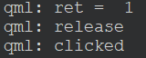

# 01. 基本使用

## 01.1 示例

```q
import QtQuick

Window {
    width: 640
    height: 480
    visible: true
    title: qsTr("Hello World")

    MouseArea {
        id: mouseArea
        height: 200
        width: 200
        /* 接收鼠标左键和右键的消息，默认只接收左键 */
        acceptedButtons: Qt.LeftButton | Qt.RightButton

        /* MouseArea默认与背景色一样，所以会在内部套一个Rectangle以显示不同的颜色 */
        Rectangle {
            anchors.fill: parent
            color: "black"
        }

        onClicked: {
            console.log("clicked")
        }
        onPressed: {
            console.log("pressed")
        }
        onReleased: {
            console.log("release")
        }
    }
}

```

## 01.2 检测是左键还是右键

```q
...
        onPressed: {
            var  ret = pressedButtons & Qt.LeftButton
            console.log("ret = ", ret)
        }
...
```

- 运行结果



- 注意：不能在 `onClicked()` 中进行判断，因为 `onClicked()` 中获取时鼠标已经松开

## 01.3 检测鼠标是否在控件上

```q
...
        /* 是否监控鼠标悬浮于控件上的状态 */
        hoverEnabled: true
...
        onHoveredChanged: {
            console.log("onHoveredChanged")
        }
        onContainsMouseChanged: {
            console.log("onContainsMouseChanged", containsMouse)
        }
...
```

