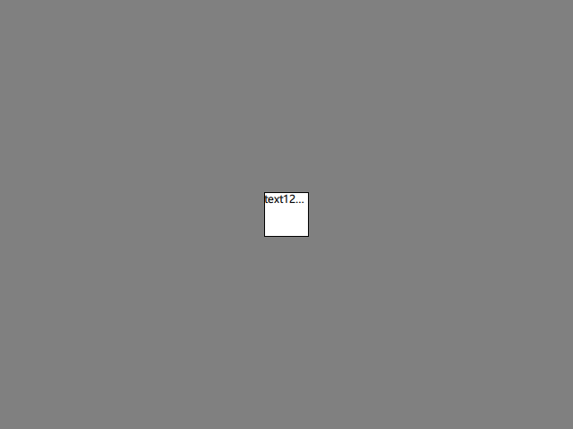
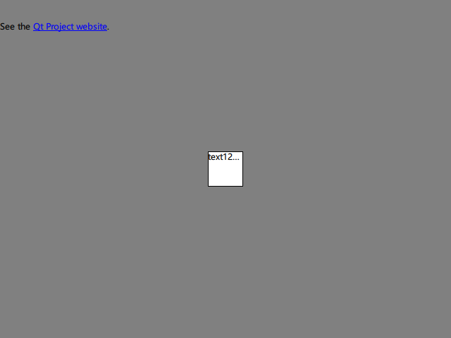

# 01. 基本使用

## 01.1 缩略显示

```q
import QtQuick

Window {
    width: 640
    height: 480
    visible: true
    title: qsTr("Hello World")

    Rectangle {
        width: 50
        height: 50
        anchors.centerIn: parent
        border.color: "black"
        Text {
            id: txt
            elide: Text.ElideRight
            anchors.fill: parent
            text: qsTr("text123123123")
        }
    }
}

```

- 将较长的 Text 以省略的形式进行显示，`elide` 和 `anchors` 属性必须同时设置
- 运行结果



## 01.2 显示超链接

```q
...
    Text {
        y: 30
        textFormat: Text.RichText
        text: "See the <a href=\"http://qt-project.org\">Qt Project website</a>."
        MouseArea {
            anchors.fill: parent
            hoverEnabled: true
            cursorShape: Qt.PointingHandCursor
        }

        onLinkActivated: (link)=> console.log(link + " link activated")
    }
...
```

- 注意：MouseArea 会覆盖 `onLinkActivated`，使其不能响应，此时可以在 MouseArea 的 onClicked 槽函数中进行处理
- 运行结果

