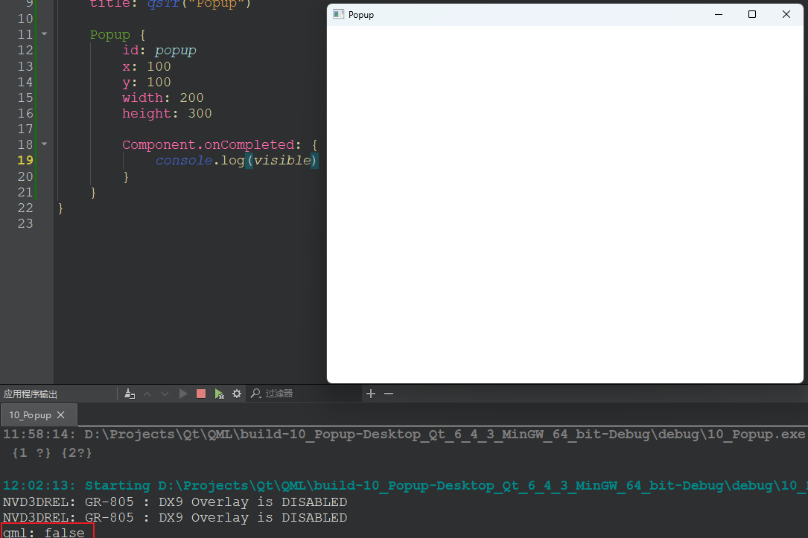
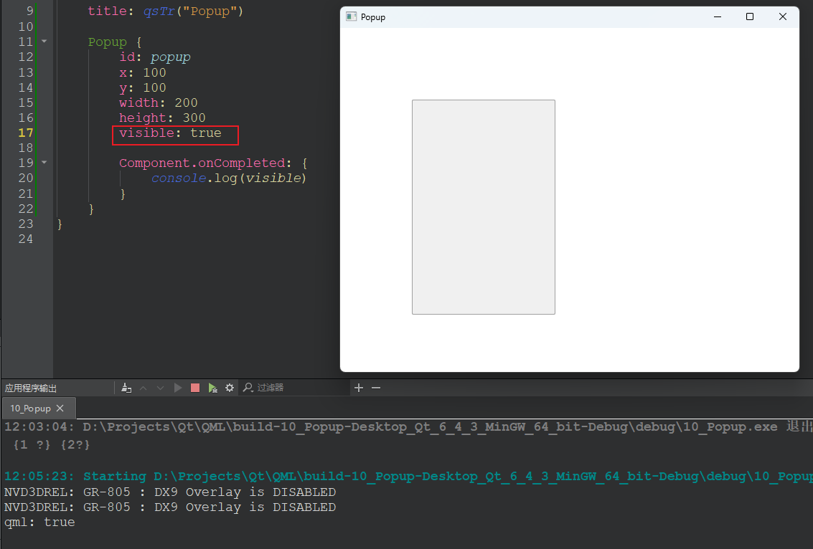

## Popup 默认隐藏

```q
import QtQuick
import QtQuick.Window 2.2
import QtQuick.Controls 2.12

Window {
    width: 640
    height: 480
    visible: true
    title: qsTr("Popup")

    Popup {
        id: popup
        x: 100
        y: 100
        width: 200
        height: 300

        Component.onCompleted: {
            console.log(visible)
        }
    }
}

```

- 结果



## 显示 Popup

直接将 visable 数值设置为 true，而且默认的 Popup 类似于 Rectangle:

```q
...
        height: 300
        visible: true

...

```

- 结果



或者使用 Popup 的 open 和 close 方法

```q
import QtQuick
import QtQuick.Window 2.2
import QtQuick.Controls 2.12

Window {
    width: 640
    height: 480
    visible: true
    title: qsTr("Popup")

    Button {
        width: 50
        height: 50
        onClicked: {
            popup.open()
        }
    }

    Button {
        x: 60
        width: 50
        height: 50
        onClicked: {
            popup.close()
        }
    }

    Popup {
        id: popup
        x: 100
        y: 100
        width: 200
        height: 300

        Component.onCompleted: {
            console.log(visible)
        }
    }
}

```

## 完整代码

```c++
import QtQuick
import QtQuick.Window 2.2
import QtQuick.Controls 2.12

Window {
    width: 640
    height: 480
    visible: true
    title: qsTr("Popup")

    /* 演示 1： Popup 使用 */
    /*
    Button {
        width: 50
        height: 50
        onClicked: {
            popup.open()
        }
    }

    Button {
        x: 60
        width: 50
        height: 50
        onClicked: {
            popup.close()
        }
    }

    Popup {
        id: popup
        x: 100
        y: 100
        width: 200
        height: 300

        Component.onCompleted: {
            console.log(visible)
        }
    }

    // 父控件设为 false，Popup 子控件并不会隐藏，它依然根据自己的 visible
    Rectangle {
        x: 120
        width: 200
        height: 100
        color: "black"
        visible: false
        Popup {
            width: 50
            height: 50
            visible: true
        }
    }
    */

    /* Popup 演示 2: Popup 的 z 值 */
    /*
    Rectangle {
        id: rect1
        y: 110
        width: 200
        height: 100
        color: "black"
    }

    // Popup 的 z 值比 rect2 低，但仍显示在 rect2 之上
    // Popup 的 z 值仅局限于 Popup 和 Popup 之间，Popup 会覆盖所有控件但在 Popup 上按 z 值覆盖
    Popup {
        x: 140
        y: 110
        width: 60
        height: 60
        visible: true
    }

    // rect2 会覆盖与 rect1 重复的地方，因为越往下，默认的 z 值越高
    // 但是 Popup 是一个例外
    Rectangle {
        id: rect2
        x: 60
        y: 110
        width: 200
        height: 100
        color: "blue"
    }
    */

    /* Popup 演示 3： */
    Button {
        id: btn1
        width: 100
        height: 50
        text: "Close Popup"
        background: Rectangle {
            anchors.fill: parent
            color: {
                "blue"
            }
        }
        contentItem: Text {
            text: btn1.text
            color: "white"
            verticalAlignment: Text.AlignVCenter
            horizontalAlignment: Text.AlignHCenter
        }

        onClicked: {
            popup1.close()
        }
    }

    Popup {
        id: popup1
        x: 110
        y: 100
        width: 300
        height: 200
        visible: true
        // 按 Esc 键或点击外部将关闭 Popup
        // closePolicy: Popup.CloseOnEscape | Popup.CloseOnPressOutside
        // 必须通过调用 close 方法关闭
        closePolicy: Popup.NoAutoClose

        // 模态：true 表示当前不能操作其它控件
        modal: true

        // dim: 控制非模态下 Popup 的背景是否需要设置
        dim: true

        // 在开启时的效果，效果由 property 指定，opacity 表示透明度，从 0->1，持续时间 1s
        enter: Transition {
            NumberAnimation {
                property: "opacity";
                from: 0.0;
                to: 1.0
                duration: 1000
            }
        }

        // 在关闭时的效果，效果由 property 指定，opacity 表示透明度，从 1->0，持续时间 1s
        exit: Transition {
            NumberAnimation {
                property: "opacity";
                from: 1.0;
                to: 0.0
                duration: 1000
            }
        }

        contentItem: Rectangle {
            anchors.fill: parent
            color: "grey"
        }

        // 设置模态时 Popup 之外的区域的样式
        Overlay.modal: Rectangle {
            anchors.fill: parent
            // 这是设置颜色的一种方法，ARGB，A 表示透明度
            color: "#33FF0000"
            // 在 Overlay.modal 之内的 Popup 是可以在有 Popup 处于焦点时点击的
            Popup {
                width: parent.width
                height: 80
                closePolicy: Popup.NoAutoClose
                visible: true
                background: Rectangle {
                    color: "transparent"
                }

                // 这个按钮可以在 popup1 显示且处于模态时可点击
                Button {
                    width: 50
                    height: 50
                    anchors.right: parent.right
                    onClicked: {
                        console.log("clicked")
                    }
                }
            }
        }

        Column {
            anchors.fill: parent
            Label {
                anchors.fill: parent
                text: qsTr("There is a Message Box Area!!!")
                font.pixelSize: 26
                wrapMode: Text.WordWrap
            }
        }

        Button {
            width: 50
            height: 30
            text: "cancel"
            anchors.bottom: parent.bottom
            anchors.bottomMargin: 30
            anchors.right: parent.right
            anchors.rightMargin: 30
        }

        Button {
            width: 50
            height: 30
            text: "ok"
            anchors.bottom: parent.bottom
            anchors.bottomMargin: 30
            anchors.left: parent.left
            anchors.leftMargin: 30
        }
    }
}

```

